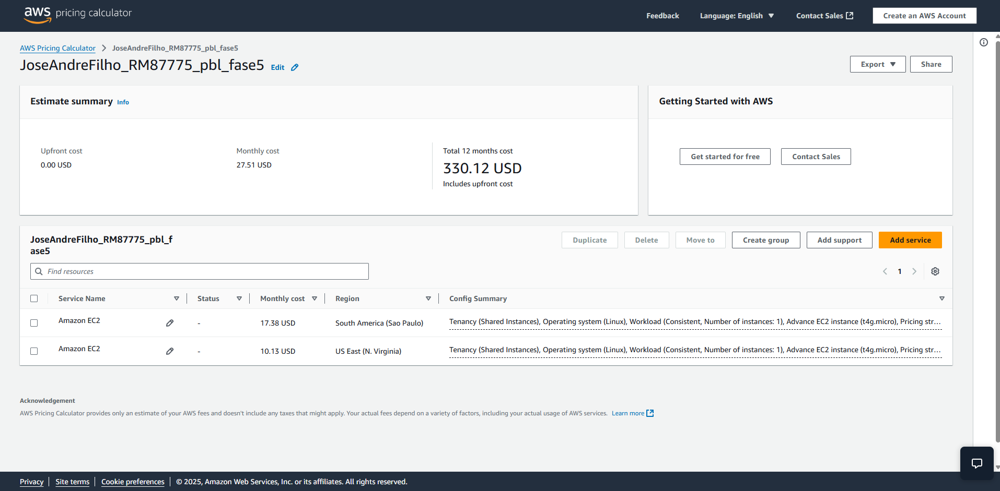

# FIAP - Faculdade de Informática e Administração Paulista

 

# **Comparativo de Custos AWS - Entrega 2**

## Integrantes:
- <a href="https://www.linkedin.com/in/joseandrefilho">Jose Andre Filho</a>

## Professores:
### Tutor 
- <a href="https://www.linkedin.com/in/leonardoorabona/">Leonardo Ruiz Orabona</a>
### Coordenador
- <a href="https://www.linkedin.com/in/profandregodoi/">André Godoi Chiovato</a>

---

## 📌 Objetivo
Este documento apresenta a estimativa de custos para hospedar uma API na AWS, comparando os preços entre as regiões **South America (São Paulo)** e **US East (N. Virginia)**. A análise considera uma instância EC2 **On-Demand (100% de uso)**, que será utilizada para receber dados de sensores e executar processos de Machine Learning.

## 🔹 Configuração da Instância EC2
- **Tipo:** `t4g.micro`
- **vCPUs:** 2
- **Memória:** 1 GiB
- **Rede:** Até 5 Gbps
- **Armazenamento:** 50 GB (EBS SSD - gp3)
- **Sistema Operacional:** Linux
- **Uso:** On-Demand (100%)

## 📊 Comparação de Custos
| Região | Custo Mensal |
|--------|--------------|
| **South America (São Paulo)** | **$17.38 USD/mês** |
| **US East (N. Virginia)** | **$10.13 USD/mês** |

### 🔍 **Análise dos Resultados**
- A região de **Virgínia do Norte** é **41.7% mais barata** do que São Paulo.
- Se **não houver restrições legais**, a melhor escolha em termos de custo é **US East (N. Virginia)**.
- Se **existirem restrições legais (LGPD) ou necessidade de acesso rápido**, a melhor opção é **South America (São Paulo)**.

## 📌 Escolha com Restrições Legais e Acesso Rápido aos Dados
### **Motivo para escolher São Paulo**
Caso seja necessário armazenar os dados dos sensores dentro do Brasil, a **única escolha possível é a região de São Paulo**.

#### **Justificativa:**
1. **Conformidade com a LGPD** 📜
   - A legislação brasileira pode exigir que os dados sejam armazenados no país para garantir proteção e transparência no tratamento das informações.

2. **Latência Reduzida** ⚡
   - Como os sensores estão no Brasil, manter os dados na mesma região reduz a latência e melhora o desempenho da API.

3. **Custos vs. Necessidade** 💰
   - Mesmo com um custo mais alto, a necessidade de conformidade legal e acesso rápido justifica a escolha de São Paulo.

## 🎥 Vídeo Explicativo
Gravamos um vídeo demonstrando a comparação de preços na **AWS Pricing Calculator** e a justificativa para a escolha da região.

🔗 **Link do vídeo (YouTube - Não Listado):** [AWS Pricing Calculator Estimate](https://calculator.aws/#/estimate?id=06b0d482c1c4ee147ea55e11cd767960484f0f93)

---

## 📄 AWS Pricing Calculator Estimate
- 🔗 [Link da Estimativa no AWS Pricing Calculator](https://calculator.aws/#/estimate?id=7fabf5cfc0cc5c9f6e397971b19126e07bf1134c)
- 📄 [Download do PDF da Estimativa](aws_estimativa_ec2.pdf)

---

## 📁 Evidências (Capturas de Tela)
### 🔹 **Comparação de Custos AWS Pricing Calculator**

---
## 📌 Conclusão
A escolha entre as regiões **São Paulo e Virgínia do Norte** depende dos **requisitos legais e técnicos**:
- **Se a prioridade for custo**, escolha **Virgínia do Norte ($6.13/mês)**.
- **Se houver restrições legais ou necessidade de acesso rápido aos dados**, escolha **São Paulo ($17.38/mês)**.

Esse estudo ajuda a definir a melhor estratégia para hospedar a API e processar os dados de sensores na AWS de forma eficiente. 🚀

---

## Licença

<a property="dct:title" rel="cc:attributionURL" href="https://github.com/agodoi/template">MODELO GIT FIAP</a> por <a rel="cc:attributionURL dct:creator" property="cc:attributionName" href="https://fiap.com.br">Fiap</a> está licenciado sobre <a href="http://creativecommons.org/licenses/by/4.0/?ref=chooser-v1" target="_blank" rel="license noopener noreferrer" style="display:inline-block;">Attribution 4.0 International</a>.

